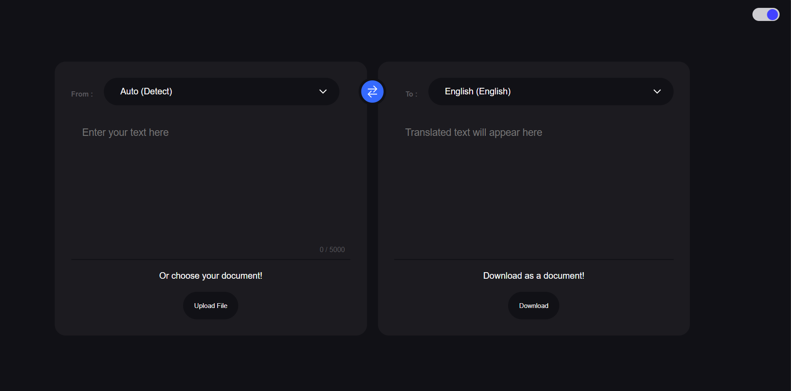

# Language Translator

A simple and efficient language translator web app built with React and Vite. This app allows you to translate text between multiple languages using REST API. It features a clean UI with dark mode support, language swapping, and document upload for easy translation of text files.

<br>
<br>



<h1><a href="https://docify-translator.netlify.app/">Visit💫</a></h1>


## Features

- Translate text between 30+ languages with automatic language detection
- Upload documents (PDF, TXT, DOC, DOCX) to translate their content
- Swap input and output languages with a single click
- Dark mode toggle for comfortable usage in low-light environments
- Download translated text as a plain text file
- Responsive and user-friendly interface

## Tech Stack

- React 19.1.0
- Vite for fast development and build
- Sass for styling

### Installation

1. Clone the repository or download the source code.
2. Navigate to the project directory in your terminal.
3. Install dependencies:

```bash
npm install
```

### Running the App

Start the development server with:

```bash
npm run dev
```

## Usage

- Select the input and output languages from the dropdown menus.
- Type or paste text into the input area, or upload a supported document.
- The translated text will appear automatically in the output area.
- Use the swap button to switch input and output languages quickly.
- Toggle dark mode using the switch at the top.
- Download the translated text as a `.txt` file using the download button.


---


